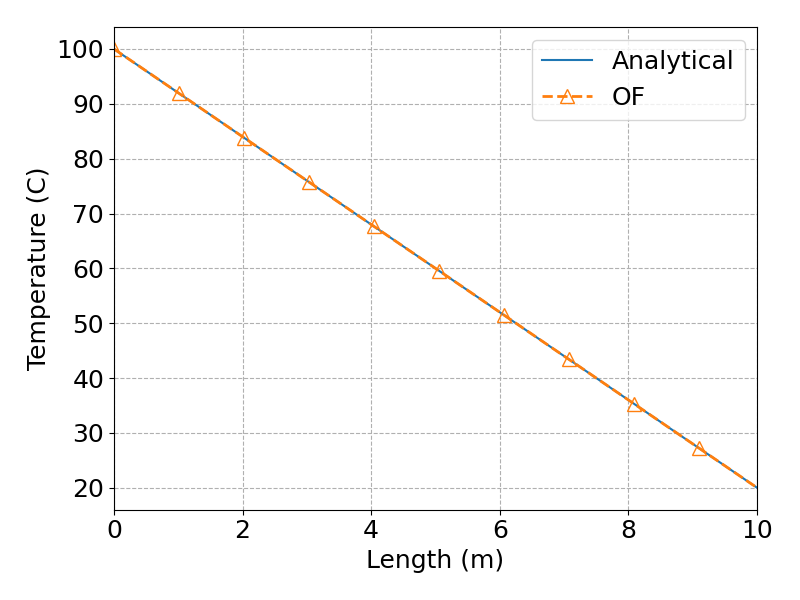
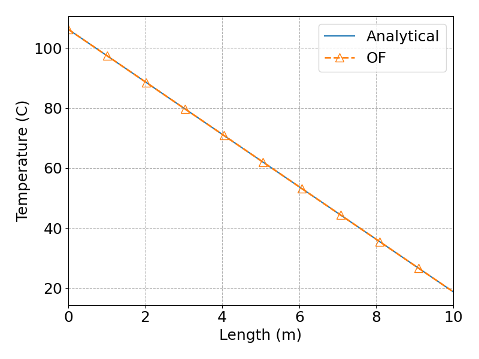
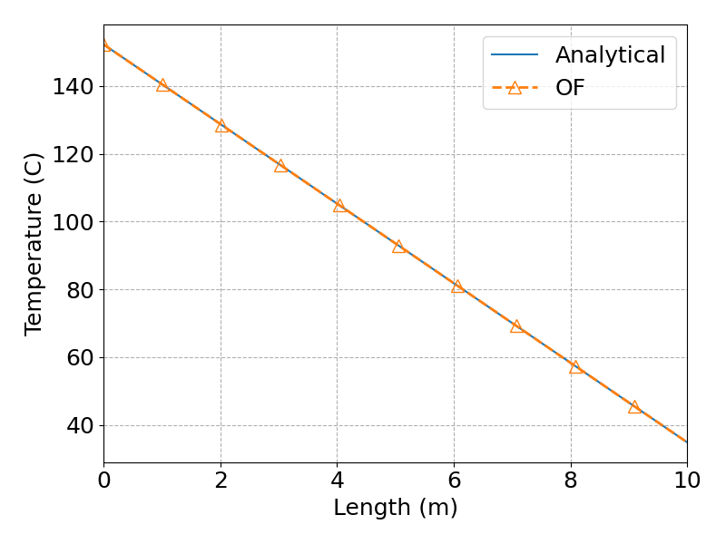
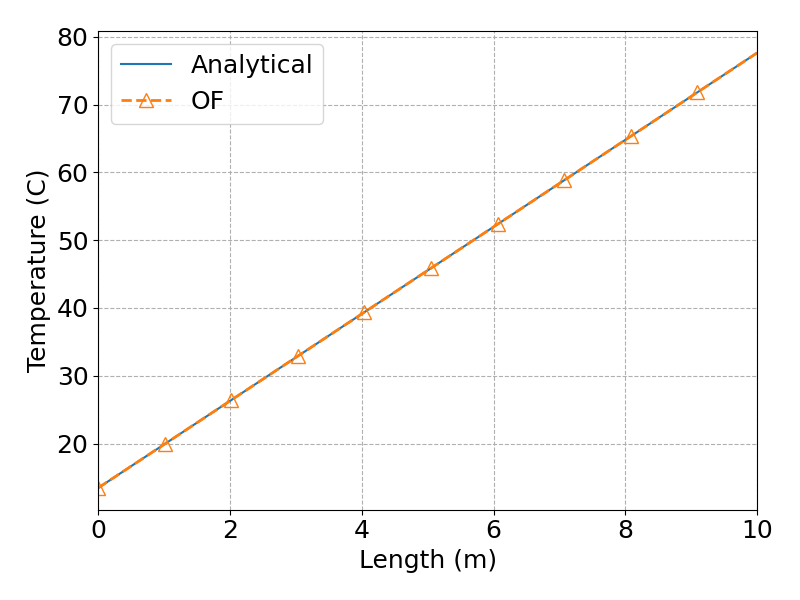
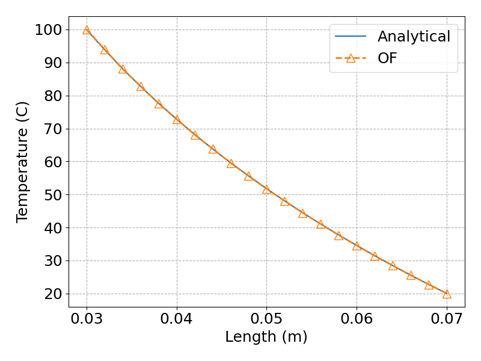
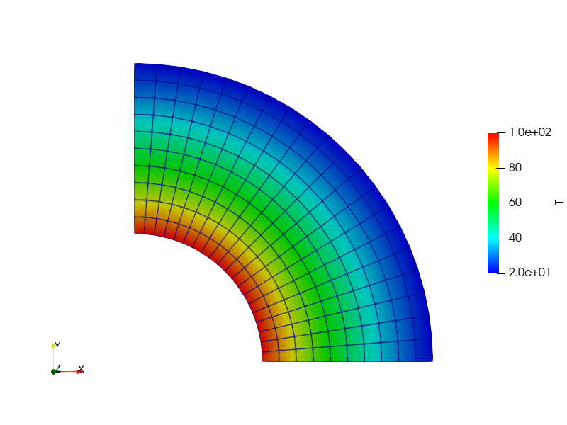

# OpenFOAM-v12-qdotsystems-heatConduction
[Qdot Systems](https://qdotsystems.com.au) :+1: provides some heat conduction tutorials using OpenFOAM-COM version and *swak4Foam* third-party tool. As a complement, these tutorials were converted to ORG version and ***codedMixed*** boundary condition, recommended approach, was introduced. No need to struggle with installing *swak4Foam*. To implement mixed boundary conditions, one has to study the heat transfer equation set and fit it into OpenFOAM format. A great explanation is given in **convection-bc_1.pdf**. For plotting purposes, Python scripts were included. Hoping that this repository will be helpful to course instructors.

These are the links describing problem definitions:

***0_Steady1DCartHeatCondEqn_OpenFOAM:***

https://qdotsystems.com.au/how-to-solve-the-heat-conduction-equation-with-openfoam-1/

***1_Steady1DCartHeatCondEqn_FluxBC_OpenFOAM:***

https://qdotsystems.com.au/flux-boundary-condition-for-1d-heat-equation-in-openfoam/

***2_Steady1DCartHeatCondEqn_ConvectionBC_CodedMixed:***

https://qdotsystems.com.au/convective-boundary-condition-for-the-1d-heat-equation-in-openfoam/

***3_Steady1DCartHeatCondEqn_CombinedBC_OpenFOAM:***

https://qdotsystems.com.au/how-to-combine-thermal-boundary-conditions-in-openfoam/

*Case-1:*

*Case-2:*

*Case-3:*

***4_SteadyRadialHeatCondEqn_TempBC_OpenFOAM:***

https://qdotsystems.com.au/a-look-at-cylindrical-heat-transfer-in-openfoam-part-1/

